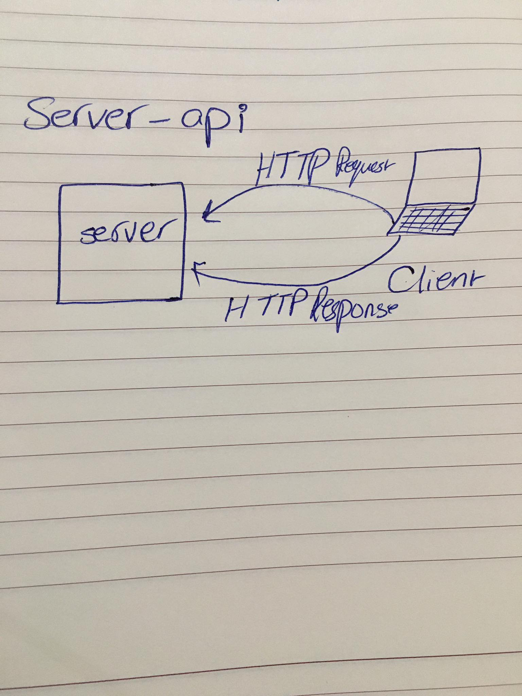

# LAB - Class 06

## Project:  api-server
#### An Express/Node.js based server designed to be a “model agnostic” REST API server, which can perform CRUD operations on any data model

### Author: Ahlam Alefishat

### Links and Resources
# Submission pull request link ()[https://github.com/AhlamAlefishat-401-advanced-javascript/api-server/pull/4]

# (Swagger documentation)[https://app.swaggerhub.com/apis-docs/ahlamalefishat96/api-server/0.1]
#### Modules
- Node.js 
- Postman 
- Swagger 

#### Packages
express , jest , supergoose

#### How to initialize/run your application
- `nodemon`

#### Test
-  node index.js 
- nodemon
- npm test

# Solution:

